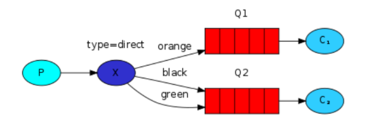
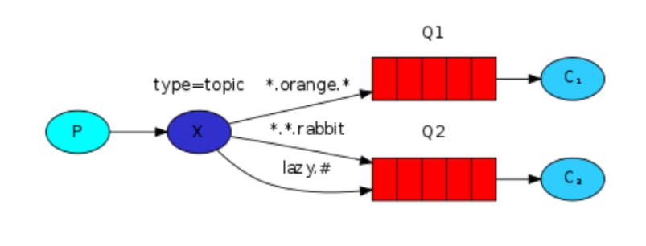

## RabbitMq-Demo-01-简单模式

```java
一个生产者对应一个消费者！
P：生产者，也就是要发送消息的程序
C：消费者：消息的接收者，会一直等待消息到来
queue：消息队列，图中红色部分。类似一个邮箱，可以缓存消息；生产者向其中投递消息，消费者从其中取出消息
```
原文连接：https://blog.csdn.net/weixin_45438044/article/details/122172490

## RabbitMq-Demo-02-工作模式

```java
与入门程序的简单模式相比，多了一个或一些消费端，多个消费端共同消费同一个队列中的消息。
在一个队列中如果有多个消费者，但是只能有一个消费者获得消息！那么消费者之间对于同一个消息的关系是竞争的关系。
```
原文连接：https://blog.csdn.net/weixin_45438044/article/details/122177327

## RabbitMq-Demo-03-订阅模式

```java
在订阅模型中，多了一个 Exchange 角色，而且过程略有变化：
P：生产者，也就是要发送消息的程序，但是不再发送到队列中，而是发给X（交换机）
C：消费者，消息的接收者，会一直等待消息到来
Queue：消息队列，接收消息、缓存消息
Exchange：交换机（X）。一方面，接收生产者发送的消息。另一方面，知道如何处理消息，例如递交给某个特别队列、递交给所有队列、或是将消息丢弃。到底如何操作，取决于Exchange的类型。Exchange有常见以下3种类型：
Fanout：广播，将消息交给所有绑定到交换机的队列
Direct：定向，把消息交给符合指定routing key 的队列
Topic：通配符，把消息交给符合routing pattern（路由模式） 的队列
Exchange（交换机）只负责转发消息，不具备存储消息的能力，因此如果没有任何队列与 Exchange 绑定，或者没有符合路由规则的队列，那么消息会丢失！
```
原文连接：https://blog.csdn.net/weixin_45438044/article/details/122180108

## RabbitMq-Demo-04-路由模式

```java
1、队列与交换机的绑定，不能是任意绑定了，而是要指定一个 RoutingKey（路由key）消息的发送方在向 Exchange 发送消息时，也必须指定消息的 RoutingKey 
    
2、Exchange 不再把消息交给每一个绑定的队列，而是根据消息的 Routing Key 进行判断，只有队列的Routingkey 与消息的 Routing key 完全一致，才会接收到消息

P：生产者，向 Exchange 发送消息，发送消息时，会指定一个routing key
X：Exchange（交换机），接收生产者的消息，然后把消息递交给与 routing key 完全匹配的队列
C1：消费者，其所在队列指定了需要 routing key 为 orange的消息
C2：消费者，其所在队列指定了需要 routing key 为 black、green的消息
```
原文连接：https://blog.csdn.net/weixin_45438044/article/details/122181713


## RabbitMq-Demo-05-主题模式

```java
1、Topic 类型与 Direct 相比，都是可以根据 RoutingKey 把消息路由到不同的队列。只不过 Topic 类型Exchange 可以让队列在绑定 Routing key 的时候使用通配符！

2、Routingkey 一般都是有一个或多个单词组成，多个单词之间以”.”分割，例如： item.insert

3、通配符规则：# 匹配一个或多个词，* 匹配不多不少恰好1个词，例如：item.# 能够匹配 item.insert.abc 或者 item.insert，item.* 只能匹配 item.insert

```
原文连接：https://blog.csdn.net/weixin_45438044/article/details/122190514


