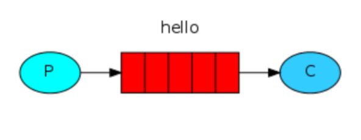
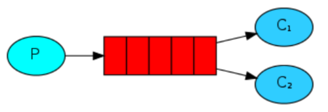
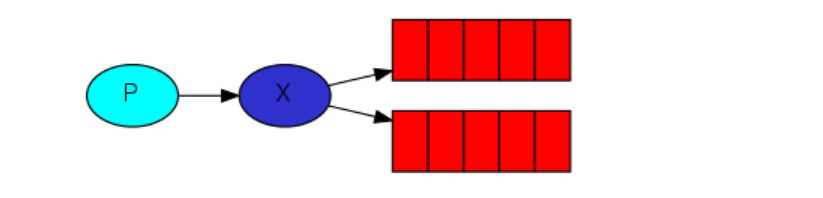

## RabbitMq-Demo-01-简单模式

```java
一个生产者对应一个消费者！
P：生产者，也就是要发送消息的程序
C：消费者：消息的接收者，会一直等待消息到来
queue：消息队列，图中红色部分。类似一个邮箱，可以缓存消息；生产者向其中投递消息，消费者从其中取出消息
```
原文连接：https://blog.csdn.net/weixin_45438044/article/details/122172490

## RabbitMq-Demo-02-工作模式

```java
与入门程序的简单模式相比，多了一个或一些消费端，多个消费端共同消费同一个队列中的消息。
在一个队列中如果有多个消费者，但是只能有一个消费者获得消息！那么消费者之间对于同一个消息的关系是竞争的关系。
```
原文连接：https://blog.csdn.net/weixin_45438044/article/details/122177327

## RabbitMq-Demo-03-订阅模式

```java
在订阅模型中，多了一个 Exchange 角色，而且过程略有变化：
P：生产者，也就是要发送消息的程序，但是不再发送到队列中，而是发给X（交换机）
C：消费者，消息的接收者，会一直等待消息到来
Queue：消息队列，接收消息、缓存消息
Exchange：交换机（X）。一方面，接收生产者发送的消息。另一方面，知道如何处理消息，例如递交给某个特别队列、递交给所有队列、或是将消息丢弃。到底如何操作，取决于Exchange的类型。Exchange有常见以下3种类型：
Fanout：广播，将消息交给所有绑定到交换机的队列
Direct：定向，把消息交给符合指定routing key 的队列
Topic：通配符，把消息交给符合routing pattern（路由模式） 的队列
Exchange（交换机）只负责转发消息，不具备存储消息的能力，因此如果没有任何队列与 Exchange 绑定，或者没有符合路由规则的队列，那么消息会丢失！
```
原文连接：https://blog.csdn.net/weixin_45438044/article/details/122180108